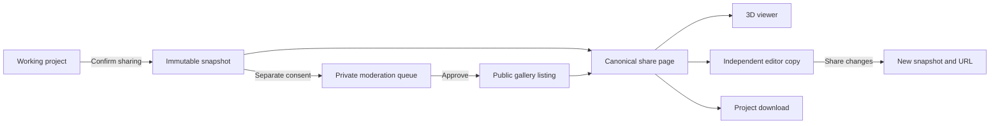

# Axe Shaper: editable sharing and public design gallery

**Prepared:** 2026-10-09

**Revised:** 2026-10-10, after review against repository release and format rules

**Status:** Proposal; implementation and launch settings pending

**Purpose:** One coherent product and delivery plan replacing the two earlier proposals

Read [Phase 0 notes](SHARING_PHASE_0_NOTES.md) for baseline evidence and
[operations](sharing-operations.md) for deployment and incident procedures.

## 1. Product goal

Let someone send a guitar or bass design as a short link. The recipient can
view it in 3D, download the complete project, and open an independent editable
copy. Let the creator separately offer that same snapshot to a public gallery,
where people can discover designs and use them as starting points.

The three concepts are:

- **Working project:** the design currently being edited on the device.
- **Shared snapshot:** an immutable, complete copy captured when sharing is confirmed.
- **Gallery listing:** an approved public listing pointing to a shared snapshot.

Editing never changes a shared snapshot. A gallery listing does not contain a
second copy of the design. Creating a link never publishes it to the gallery.

This plan treats the previous documents as background proposals, not approved
instructions. It adopts the complete-copy semantics from the editable-sharing
proposal and the discovery goal from the gallery proposal. It replaces their
competing backends with one service alongside the existing web app.

Historical source proposals, `axe-shaper-editable-sharing-plan.md` and
`axe-shaper-design-sharing-gallery.md`, are owner-local and not in this repository.
They provide context; implementation follows the repository contracts and
the decisions recorded in this plan.

## 2. Recommended scope and defaults

| Topic | Recommended default |
| --- | --- |
| Backend | Firebase/Google Cloud alongside the existing Firebase-hosted app |
| Repositories | Service and gallery in `axe-shaper-app`; viewer remains independently released |
| User accounts | None required for sharing, browsing, or gallery submissions |
| Link visibility | Unlisted; anyone with the URL can access and forward it |
| Snapshot contents | Complete saved project, not the reduced viewer payload |
| Gallery publication | Explicit submission followed by manual approval |
| Creator control | A separate secret permits withdrawal and link revocation |
| Retention | No scheduled expiry initially; creator or administrator can remove a share |
| Persistent preview | Static generic social card in Release A; generated 2D outline in Release B |
| Native image sharing | Current 3D PNG plus the snapshot link where supported |
| Gallery reuse terms | Proposed CC0 1.0, with explicit consent and rights confirmation |
| Gallery browsing | Newest first; guitar/bass and string-count filters; cursor pagination |
| Initial clients | Browser editor and browser viewer; iPad integration follows |
| Launch environments | Move PR previews and main staging off the production project before service rewrites ship |

CC0 is proposed to keep anonymous reuse straightforward. It permits reuse,
including commercial reuse, without mandatory attribution, subject to rights
the contributor actually holds and other applicable rights. Display that choice
plainly and do not preselect its consent checkbox. Changing this proposal to an
attribution licence requires corresponding provenance and export requirements.
[Creative Commons CC0 guidance](https://creativecommons.org/public-domain/)

Not included in the first releases: collaborative editing, cloud autosave,
accounts, profiles, comments, likes, rankings, paid designs, arbitrary uploaded
images, full-text search, or server-rendered 3D thumbnails.

### Delivery boundary

**Release A: editable links.** Complete snapshots, short links, landing pages,
static generic social card, editor/viewer loading, file download, simple creator
revocation, and operational controls. Keep local keys and a small recovery-key
export; defer recovery-file import, the local management library, image workers,
and the preview bucket.

**Release B: public gallery.** Publication consent, moderation, browsing,
reporting, withdrawal, generated outline previews, management-library/recovery
import UI, and reuse metadata. These reuse Release A's snapshots.

Release B is part of the intended product, not an abandoned future idea. It
ships after the sharing flow is verified so discovery does not hold up useful
link sharing.

## 3. Current codebase baseline

Checked locally on 2026-10-10:

| Existing component | What it means for this work |
| --- | --- |
| `src/App.tsx` | `/app` is the only editor pathname recognized; share paths need explicit routing |
| `handleShareProject()` | Already shares a `.axe.svg` file, with a download fallback; retain this option |
| `src/utils/viewer3dLink.ts` | Builds compressed fragment links from a reduced 3D projection |
| `src/utils/svgExporter.ts` | Exports complete project data and extracts embedded data from `.axe.svg` |
| `loadProject()` in `src/utils/presets.ts` | Existing migration and editable compatibility boundary |
| `withEmbeddedPresets()` in the same file | Produces the full payload embedded by the SVG exporter; reuse it |
| `src/constants/schema.ts` | Reads through schema 8; saves use the lowest schema required by actual fields |
| `src/utils/editorNavigation.ts` | Existing unsaved-change and browser-history behavior to extend |
| `planParamFromLocation()` / `EditorRoute` | Existing no-chooser-flash loading, fresh session and URL normalization for `?plan=` |
| `firebase.json` | Static Hosting, viewer rewrite, then SPA fallback; no service rewrites |
| `.firebaserc` | Default Firebase project is `axe-shaper-web` |
| `viewer3d.version` | Viewer release currently pinned to `v0.1.24` |
| Separate viewer source | Reads schema 8, handles existing fragment links, and captures PNGs |
| Three Hosting workflows | PR channels, `main` → `staging` channel, `v*` tag → live; all currently target `axe-shaper-web` |
| `VITE_OUTPUT_JACKS` | Staging enables authoring; live tags keep it off until the compatible iPad release is live |
| `verify.yml` / `scripts/check-all.ts` | Secret-free web correctness gate and local cross-repository evidence |

The current viewer projection deliberately leaves out back routes, most editor
settings, project metadata, and other save-file information. **It must not
become the stored editable snapshot.** Store the existing complete save payload
produced by `withEmbeddedPresets()`, including `requiredSchemaVersion()` stamping.
Canonical JSON ordering is for hashing, not a second project representation.

Before choosing edition-specific collections, queries, indexes, or SDK APIs,
inspect the actual database. The records described below are a logical service
contract; their final Firestore mapping is a Phase 0 deliverable.
One-off cloud findings and the environment decision are recorded in
[Phase 0 notes](SHARING_PHASE_0_NOTES.md).

## 4. User journeys

### Create an editable link

1. The editor's **Share** action offers **Create link** and **Share project file**.
2. The link dialog previews the title and any author metadata that will be uploaded.
   A blank author is allowed. Metadata changes for sharing affect the snapshot,
   not silently the working project.
3. Explain: anyone with the link can view, download, edit a copy, and forward it;
   recipient edits do not change the original; project data is stored on Axe
   Shaper's servers. Release B also stores a generated preview. Reference-image
   pixels remain local.
4. **Create link** freezes the exact payload. Background edits while creation is
   in progress do not enter that snapshot.
5. On success, show **Copy link**, **Open shared design**, **Manage this link**,
   and **Save recovery key**. Add **Submit to gallery** in Release B. A pending
   Release B preview does not block copying the link.
6. Explain how to save the recovery key before leaving the success view; it can
   be pasted into the simple management page if local storage is lost.

Before showing upload consent, prepare the normal full save payload locally and
run the same pure strict upload validator used by the server, with the current
`/api/sharing-status` policy revision and schema ceiling. Check unknown keys and
enum values as well as declared/required schema and resource limits. Disable
**Create link** when unsupported and offer **Share project file**. Unknown
vocabulary gets: **This design contains fields from a newer app. Share the project
file instead.** Unsupported schema gets the compatible-app/update explanation.
If status cannot be checked or creation is paused, show the file fallback without
uploading. Recheck the frozen payload at confirmation because edits/status can
change. The server still enforces admission; a stale client check is not authority.

Cancel before confirmation creates nothing. Cancel after a request was sent
cannot guarantee that it was not accepted; retain the operation key and let the
user recover its result. Retrying the same confirmed operation creates one share.

### Open and edit

The canonical `/share/:id` landing page offers **View in 3D**, **Open editable
copy**, and **Download project**. These are real links in server-produced HTML.
Opening the page does not require JavaScript or a login; the editor and viewer do.

The editor opens the snapshot clean, resets history and selection using normal
file-open semantics, and shows **Editing a copy of a shared design** with a link
to the source. Edits affect only that session. Sharing edits creates a new ID.

Do not reuse the source URL to imply it reflects the recipient's changed design.
Preserve the existing unsaved-change confirmation when another design opens.
Cancel stale fetches so an earlier request cannot replace a newer session.

Extend the existing `?plan=` / `EditorRoute` loader rather than build a second
editor shell. Add a share input source to its loading state, pass the validated
project through `loadProject()`, and use its `openProject()` session reset.
Generate the fetch URL from a validated share ID as a same-origin absolute path;
retain `planParamFromSearch()` restrictions for file links. Test both paths
against the existing `e2e/editor.spec.ts` no-flash/history behavior.

After a successful share open, retain the source URL in session provenance and
normalize the editor address to `/app` with `replaceState`, as the plan loader
does, so a reload does not silently reapply the snapshot. Share errors stay in
an actionable error state with an explicit chooser action; unlike ordinary
failed `?plan=` links, they do not silently route to another design.

### Publish to the gallery

1. Submission is a separate action on an existing snapshot and requires its
   management secret. A recipient can instead create and submit their own share.
2. Show the exact snapshot preview and public metadata, including an optional
   display name. Public listing metadata is separate from embedded project metadata;
   warn that the downloadable project still contains the latter.
3. Explain public discovery and the selected reuse terms. Require an unchecked
   agreement to those terms and confirmation that the contributor has the rights
   needed to offer the design. Being based on a bundled blueprint does not itself
   establish those rights; do not automatically publish bundled designs.
4. Accept the submission into a private moderation queue. The link continues
   working while approval is pending. No public pending-items API exists.
5. Approval makes a listing visible. Rejection supplies a brief creator-visible
   reason without disabling the share unless separate removal is warranted.

Approved titles/descriptions/licence terms are fixed for that submission.
Changing public metadata requires another review; changing geometry always
requires a new snapshot. A withdrawn or rejected submission can be resubmitted
under the same share ID with a new submission revision and explicit consent.

### Browse and reuse

The web app owns `/gallery`. Cards show the outline preview, title,
guitar/bass, string count, optional display name, and reuse terms. Default to
newest approved publications, with an initial page of 24 items.

A card opens the existing canonical share page. People can view, download,
or edit a copy through the same flow as a directly shared link. Empty galleries
explain how submission works; empty filtered results offer to clear filters.
Show loading, unavailable, and next-page states without losing chosen filters.

### Withdraw or revoke

- **Withdraw from gallery:** hides the listing and cancels pending submissions;
  the share link remains accessible.
- **Revoke share link:** immediately denies new origin access to the project,
  withdraws the listing, and schedules data/image cleanup.

Explain these effects separately. Previously downloaded designs and third-party
social preview copies cannot be recalled. Withdrawal does not undo reuse rights
already granted by publication.

## 5. Service architecture and contract

Keep the API and gallery in this repository. Use existing classic Firebase
Hosting for the site, viewer bundle, and API/HTML rewrites. Release A uses
Functions v2 HTTP handlers, Firestore, and a shipped static generic card.
Release B adds the media rewrite, a bounded preview worker, and a private Cloud
Storage bucket for generated previews.

Use one backend rather than a parallel Cloudflare upload service. No raw SVG
upload endpoint is needed: users open files locally, then upload validated
project JSON. File download uses the existing browser exporter.

### Public and creator routes

| Method and route | Purpose and access |
| --- | --- |
| `POST /api/shares` | Create snapshot; App Check, validation, quotas, idempotency |
| `GET /api/sharing-status` | Public release/environment marker and admission ceiling; no secrets |
| `GET /api/shares/:id` | Complete public snapshot envelope; no login/App Check |
| `GET /share/:id` | Server HTML and social metadata; no login/App Check |
| `GET /app/share/:id` | SPA editor route loading an independent copy |
| `GET /download/share/:id` | Browser download view using the normal exporter |
| `GET /viewer3d/?share=:id` | Independently released viewer fetches the snapshot |
| `GET /media/shares/:id/v1.jpg` | Release B generated preview, subject to lifecycle checks |
| `GET /gallery` | Release B gallery UI |
| `GET /manage/shares` | Release B local management library and recovery-file import |
| `GET /manage/share/:id` | Simple creator management UI; local key or pasted key; no secret in URL |
| `GET /api/gallery` | Release B bounded approved-listing page and next cursor |
| `GET /api/shares/:id/manage` | Creator status; management secret required |
| `POST /api/shares/:id/publication` | Release B submission; secret, App Check, quotas |
| `DELETE /api/shares/:id/publication` | Release B withdrawal; management secret required |
| `DELETE /api/shares/:id` | Revoke; management secret required |
| `POST /api/reports` | Release B bounded abuse report; App Check and quotas |

Administrative approval/removal uses an IAM-protected tool or service, not a
public route guarded by a shared password. Authorize only specific administrators.

There is one share URL: `https://<configured-origin>/share/<id>`. A separate
redirect alias is unnecessary initially. Returned URLs use configured trusted
origins, never user-provided destinations or an arbitrary Host header.

Group handlers by operational purpose: creation/submission, public reads,
media, creator management, and preview generation. Use independent scaling and
feature switches. Put service rewrites before the viewer rewrite and final SPA
fallback. Declare function regions explicitly and use compatible pinned
revisions. Hosting supports v2 function pinning, but pinning does not isolate
backend data. [Hosting function rewrites and pinning](https://firebase.google.com/docs/hosting/functions)

### Snapshot envelope

The public envelope contains a share-format version, share ID, full project,
actual project-schema version, creation time, preview kind/status/URL, and any approved
publication licence/source information. It never contains management-secret
hashes, IP keys, quota records, reports, or pending moderation content.

Use `preview.kind = generic` in Release A without pending work or a worker;
Release B can use `generated` with pending/ready/failed states. Define this
additive transition in the versioned envelope so old readers keep working.

The envelope also declares the required project schema and references the
tagged client-support manifest (web/viewer ceilings and minimum editable iPad
release by schema). A reader compares those requirements with its own actual
capabilities; the server cannot promise that every installed app can edit.
Landing/download pages and gallery cards show the minimum iPad app version
when known, with update guidance. Do not derive compatibility from user-agent
strings or invent an unconditional `canEdit` boolean.

Keep the envelope version independent of the project schema. Define errors
consistently: malformed request/ID, missing, revoked, unsupported schema,
too large, quota exhausted, and temporarily unavailable. Use appropriate HTTP
statuses; 429/503 must not appear as “design not found.” Revoked shares use 410
while a tombstone exists, and may return 404 after final cleanup.

Preserve existing fragment-only viewer URLs. A present `share` query parameter
selects remote loading; invalid or failed remote loading displays an error
and never falls through to an unrelated fragment/default design.

## 6. Logical records, compatibility, and concurrency

Finalize physical storage after database edition detection. Separate public
responses from internal records regardless of edition.

| Logical record | Contents and lifecycle |
| --- | --- |
| Snapshot | Immutable project, digest, schema/envelope versions, creation time |
| Share control | Active/revoked state, management-secret hash; Release B preview state/lease |
| Publication request | Share ID, revision, submitted metadata, consent version/time, review state |
| Gallery entry | Approved bounded metadata, active flag, publication time, preview reference |
| Operation | Expiring idempotency key digest, request digest, result share/submission ID |
| Quota | Expiring global and client counters |
| Report | Bounded reason, target ID, timestamps, moderation state |

Allocate opaque, nonsequential 20-character alphanumeric share IDs. IDs permit
reading, not management. Validate ID syntax before any database lookup and
bound repeated missing-ID reads with short negative caching and throttling.
Do not expose a content-addressed lookup or deduplicate
different people's uploads by design hash. A digest supports integrity and retry
comparison, not identity, rights verification, or public discovery.

### Complete-project validation

The client runs `withEmbeddedPresets()` to prepare the wire `StoredProject`
payload that `exportProjectToSVG()` embeds. The server validates that received
payload without running `withEmbeddedPresets()`, migration, catalogue lookup,
coercion, rounding, default filling, or schema stamping. Refuse missing embedded
`neckPreset` or `bridgePreset`; do not resolve them from IDs. Preserve unfamiliar
preset IDs when their embedded geometry meets the known contract.
Store exactly the validated project JSON value received, with no rewritten
project fields. Canonical ordering is used only for digest calculation; JSON
whitespace/key order is not a stored-file byte-identity guarantee. The client
and server digest the same project value, and the server verifies the digest.
`exportProjectToSVG(envelope.project)` remains the download path.
Keep geometry precision and supported optional fields, including
back routes, all saved settings, embedded presets, v7 joint/placement pairs,
appearance, controls, and schema-8 jacks. Include project metadata deliberately
after disclosure. Exclude local reference pixels, runtime state, selections,
undo history, DOM objects, and local/object URLs.

Validate the declared schema first. Network creation accepts complete saved
payloads from schema 3 through the release's admission ceiling; older local
files first pass through the existing client load/save path. `loadProject()` and
viewer file parsing are not complete validators for anonymous requests.

For anonymous uploads, reject unknown keys recursively in the project and share
request envelope, using explicit field sets/types from the supported contracts.
Only variable keys expressly defined by a known dictionary field are permitted;
no unrestricted extension bag is accepted at launch. Reject unknown enum values
where editing depends on them. Do not strip rejected content or silently lower
its version. This strict upload admission is separate from tolerant local file
decoding/round-tripping: those policies stay unchanged. A future field hidden
under a v7 declaration therefore cannot bypass the ceiling through an unknown key.

Enforce structural types, finite geometry, valid instrument combinations,
paired fields, permitted enum values, string lengths, object depth, total
anchors/placements, and serialized size. Reject unsafe object keys. Set numeric
and complexity bounds from authored fixtures, then adversarially test them.

Start measuring with a proposed 512 KiB whole-request limit. Leave explicit
space for envelopes and storage overhead; the accepted project budget is lower.
Oversized designs get a clear project-file fallback. Do not apply the viewer's
32 MiB local-file allowance to server uploads.

Use **RFC 8785 JCS → UTF-8 → SHA-256**, rendered as `sha256:<lowercase hex>`.
The [sharing-format draft](AXE_SHARING_FORMAT.md) fixes the hash scope, input
constraints and canonicalization scheme before Phase 1. Its fixed digest vectors
cover floating-point and property-order edge cases independently of upload
admission; Swift `JSONEncoder` output alone is not the hash input.
Do not index large project
payloads; select edition-appropriate index exclusions and only the metadata
indexes justified by real queries.

### Server admission and cross-platform release gate

The service has an explicit environment/release-owned admission ceiling,
`maxAcceptedProjectSchema`, independent of the validator's compiled read ceiling.
Production sets it from the live tag's release manifest and the confirmed
editable schema support of the shipping iPad app. Staging may accept unreleased
schemas only in its isolated project. Phase 0 records the evidence; do not
infer App Store availability from the local iOS source or a successful test.

Check both the input's declared version and `requiredSchemaVersion()` computed
directly on the exact received, validated project against the ceiling before
writes. Require the save stamp to match the required version; never repair it. A
misstamped v7 payload with jacks cannot bypass an admission ceiling of 7.
Refuse it rather than delete the jacks or downgrade its schema.

The present staging flag allows designs with jacks to require schema 8; designs
without jacks keep their required schema. The live feature flag remains off
until an iPad release supporting v8 is confirmed live. While that gate is closed,
production admission also excludes v8 snapshots even though web/viewer readers
already understand them. Higher-ceiling links/IDs never cross staging into the
production API or gallery. Once v8 is approved, the live tag records both
authoring and admission changes. Older installed apps still need update guidance.

Changing admission affects new uploads/publication, not an existing snapshot's
bytes. A rollback must preserve valid existing reads and disclose any reader
limitations; do not rewrite v8 snapshots as v7 to make an old build accept them.

Complete the [sharing-format draft](AXE_SHARING_FORMAT.md), a sibling of
`docs/AXE_SVG_FORMAT.md`, during Phase 1. Include
generic/generated-preview envelopes, errors, support manifests, and schema-7/8
examples under `tests/fixtures/sharing/`. Use the existing saved-project fixtures
and corpus as authoritative payloads; check deep equality with the project's
decoded `.axe.svg` data and extend `fixtures:check`. Only the envelope/API
adapter is new to the future iPad client; its project decoding policy stays.
Admission fixtures explicitly distinguish accepted uploads from tolerant
file-round-trip fixtures. `tests/fixtures/web-written-v8/output_jacks.axe.svg`,
its `ios-written-v5/web_roundtrip_output_jacks.axe.svg` return, and
`ios-written-v5/output_jacks.axe.svg` are expected strict upload rejections for
unknown mounting vocabulary (and unknown fields where present), even with a
schema-8 ceiling. Keep their existing preservation tests unchanged. Add a
separate known-vocabulary v8 success case; do not sanitize the original fixtures.
The independently implemented viewer also consumes `tests/fixtures/sharing/`:
sync the versioned fixtures into that repository's contract tests and require its
own `npm run check` to validate envelope parsing, errors, schema gates and preview
variants. Record the fixture revision/digests; a web-only parse test is insufficient.

### Idempotency and management secrets

Before sending creation, the browser generates separate high-entropy operation
and management secrets (at least 256 random bits each) and saves the pending
operation locally. The server
stores hashes, never the plaintext management secret. Transport the management
secret in an authorization header for later creator actions, never in public
URLs, query strings, gallery data, or logs.

A creation transaction checks the operation, global/client quotas, and writes
the snapshot/control/result atomically. An identical retry returns the same ID;
different content or management-secret hash under that key returns 409.
Concurrent retries count once. Release B enqueues one logical preview job.

Keep operation records for a proposed 24 hours and limit automatic retries to
that window. Do not present expiry of retry protection as a safe automatic new
creation. A retry of an already revoked result never restores it.

Store the creator key locally and offer a small recovery-key text export with
the share ID. Release A's management page retrieves the local key or accepts a
pasted key; it needs no recovery-file parser or management-library screen.
Release B adds file import and the **My shared links** device-local library.
Losing local storage and the saved key loses self-service management; disclose
that limitation and provide an administrative removal-request channel.
Possession of the key establishes management capability, not authorship.

Publication, review, withdrawal, and revocation carry revisions/preconditions.
Transactions prevent an approval racing withdrawal/revocation from making the
listing public. A review only approves the exact submitted revision.

### Gallery queries

Query only active approved entries, with optional instrument/string-count
filters, ordered by publication time and share ID for stable tie-breaking.
Return at most 24 bounded cards and a validated opaque cursor. Never download
all projects or rebuild a shared `index.json` per upload.

Use the database edition's supported cursor/pagination APIs. Cursor-based
pagination is the recommended starting point; the current Standard API documents
`startAfter` and limits. [Firestore cursor pagination](https://firebase.google.com/docs/firestore/query-data/query-cursors)

Different pages can reflect concurrent publication changes; do not promise a
frozen gallery. Prevent duplicate cards in the client and test insertion/removal
between page fetches. Avoid full-text search until volume justifies a separate
design.

## 7. Previews, social sharing, and downloads

### Persistent preview — Release B

Release A serves a generic card bundled with Hosting. It creates no preview
jobs, private media objects, leases, or image-cleanup work. The snapshot envelope
reserves the additive preview fields needed below.

Generate one 1200×630 JPEG from validated body geometry with fixed branding and
an escaped, bounded title. Use application-owned SVG shapes rasterized by a
bounded Node renderer. No arbitrary SVG, external font/image URLs, or uploaded
screenshots enter this worker. Target 250–300 KiB and enforce a 350 KiB maximum.
The gallery uses this same image; it does not trigger another render.

The worker claims a lease, writes a deterministic versioned object, verifies
dimensions/bytes, and marks ready only after success. Duplicate delivery is safe;
expired leases recover; retries are limited. A failed preview uses a generic
static card and does not break the design. Publication approval requires a ready
individual preview so gallery cards represent their designs.

Recheck active state before finalizing output. A revocation racing generation
must leave media inaccessible and allow cleanup to remove late/orphan objects.
Never generate previews during a GET. The bucket is private and does not allow
client upload or listing.

### Social page and caching

Serve real 200 HTML for valid active share pages with escaped title/description,
absolute canonical and image URLs, Open Graph dimensions/type/alt, and Twitter
card metadata. Unlisted shares use `noindex`; this is a discovery instruction,
not confidentiality. Approved publications can become indexable after the
moderation/licence flow is ready. Use a restrictive referrer policy on share and
management pages to reduce incidental identifier exposure.

Keep project JSON and management/mutation responses `no-store`. Proposed CDN
cache windows: Release A landing HTML five minutes; Release B pending landing
HTML 60 seconds, ready HTML/gallery responses five minutes, media one hour.
Avoid stale serving beyond the stated removal
window. Response cache controls must be verified through the actual Hosting
path. [Hosting cache behavior](https://firebase.google.com/docs/hosting/manage-cache)

Withdrawal/revocation denies fresh origin reads immediately, but already cached
pages/images can remain until invalidated or expired. Document this bounded
service cache window separately from uncontrolled social-platform caching.

Release A intentionally uses the generic card. In Release B, early social
fetches may cache it before the individual card is ready. Offer Copy link
immediately and explain preparation; the native image-share action depends
on local PNG readiness, not on the server image worker.

### Current 3D image plus link

In the viewer, prepare the canonical link and PNG before enabling a final
**Share** button. Call the native share API directly from that click. Check
combined-data support, treat cancellation normally, and offer Copy link and
Download image fallbacks. Receiving apps may handle image/text/URL differently;
test real targets. The temporary PNG remains local and is not the stored card.
[Web Share specification](https://www.w3.org/TR/web-share/)

For an unshared local design, retain existing fragment sharing and PNG download.
Do not silently upload a new project merely because someone shares a screenshot.

### Project download and reuse information

`/download/share/:id` fetches and validates the full envelope, then calls the
normal `.axe.svg` exporter. Display a download button if automatic download is
blocked. Do not build a second backend SVG exporter.

When a published snapshot is opened, retain source URL and reuse terms in
editor-session provenance outside geometry. Display them in the download view.
Keep the record of granted publication terms after gallery withdrawal so an
unlisted share does not falsely appear to have had those terms rescinded.
Release B also supplies a small reuse-information file with project download,
containing licence, source URL, and optional contributor credit. This is separate
from the project schema and must not alter geometry compatibility.

## 8. Anonymous access, moderation, and privacy

Require Firebase App Check for browser creation, publication submissions, and
reporting. Independently validate management capabilities for creator changes.
Public reads and social images require neither login nor App Check. App Check
attests a registered app; it does not establish identity or enforce daily quotas.
[App Check backend verification](https://firebase.google.com/docs/app-check/custom-resource-backend)

Deny direct client access to snapshot/control/moderation records and the preview
bucket. Functions use dedicated runtime identities and minimum practical IAM
permissions; privileged SDK access still requires server validation. Browser
gallery access also goes through the bounded HTTP API.

Creator keys in `localStorage` share an origin with the independently released
`/viewer3d/` bundle. An XSS defect in either app can expose those keys; path prefixes
do not isolate browser storage. Treat both apps as one trusted origin for script
security and review the composed bundle/CSP accordingly.
[Web Storage origin scope](https://developer.mozilla.org/en-US/docs/Web/API/Web_Storage_API)

Resolve the trusted proxy/IP chain before using addresses in rate limits. Use
short-lived keyed hashes with a protected rotating key, not stored raw IPs or
persistent anonymous identities. Review platform request logs as well as app
logs. Avoid logging projects, management secrets, or full share URLs. Do not
claim there is no personal data: titles, authors, reports, and platform logs can
contain it.

The moderation queue shows the design preview, public metadata, proposed reuse
terms, and submission revision. Before approval, an administrator checks spam,
offensive text, obvious rights problems, and whether the preview/design matches.
Approval is not a certification of authorship or physical build suitability.

Add a moderation aid comparing the submitted body against the bundled outlines:
an exact canonical-geometry match flag, plus a nearest-outline overlay/difference
using deterministic sampling and a documented tolerance. Show the source
blueprint ID as a hint, not proof; users can change IDs and hardware without
changing the outline. Flag unchanged outlines for explicit review rather than
auto-approve them. Keep this work bounded and compute it at submission, not on
gallery reads. An exact match or small difference is not a legal determination.

Before Release B, record a concrete policy for bundled-blueprint derivatives,
unchanged commercial silhouettes, names, and brand marks. A copyright waiver
does not establish all third-party permissions; CC0 expressly leaves trademark
and patent rights unaffected. The recognizable-shape/trade-dress question needs
an owner decision before gallery publication, not a claim that CC0 resolves it.
[CC0 deed and limitations](https://creativecommons.org/publicdomain/zero/1.0/)

Reports have predefined reasons and an optional bounded explanation, with no
required email. Aggregate duplicate reports where practical, cap retention and
queue size, and preserve an administrator's ability to remove the listing only
or revoke the share entirely. Public reports never automatically grant editing
or removal access.

Before either release, update privacy/support pages to cover uploaded metadata
and projects, public-link access, gallery discovery, generated images, provider
storage/logging, limiter retention, recovery-key behavior, removal requests,
and retained backup/soft-delete windows. Guide/reference pixels stay local.

## 9. Retention and operational policy

Keep active snapshots until creator or administrative removal; there is no
scheduled expiry. Persistent does not mean permanent guaranteed availability.
Revocation immediately denies fresh origin access, withdraws listings, and
starts retryable cleanup with an initial 24-hour target. Cached pages/images
have separate bounded windows; downloaded copies cannot be recalled.

Release A needs record cleanup only; Release B adds private images, lease
recovery and orphan cleanup. Declare provider backup/soft-delete retention.
Do not age-delete images still promised by active links. At 100 shares/day,
300 KiB previews add about 10.4 GiB/year at sustained maximum usage.

Release configuration records resource/quota defaults, the admission ceiling,
and build-time authoring flags. Incident switches are separate private runtime
state changed through an IAM-protected admin tool without a release. They may
pause creation, publication, generation, gallery/media/project reads, but never
raise schema admission. Cache controls for at most 60 seconds; preserve current
switches across deployments and rollbacks. Clients see effective availability.

Functions require Blaze billing; inspect production's current plan and account
before provisioning. Any upgrade covers the existing project/site as well as
sharing. Set separate staging budgets. Alerts and eligible spend caps are not a
guaranteed all-services dollar ceiling.
[Firebase pricing plans](https://firebase.google.com/docs/projects/billing/firebase-pricing-plans)

The [operations document](sharing-operations.md) owns launch quotas/scaling,
budget controls, runtime-switch failure behavior, maintenance and incident
response. These are launch criteria, not extra product features.

## 10. Environment and release decisions

The [Phase 0a procedure](sharing-operations.md#standalone-phase-0a-migrate-hosting-before-the-backend)
owns the Hosting-only migration of PR/main lanes to a separate staging project,
its acceptance and rollback. Production remains `axe-shaper-web`; previews have
no service rewrites. Phase 4 later adds backend deployment to these settled lanes.

Coordinated tags match the associated iPad release, for example `v1.2.0`.
Web/backend hotfixes use `v1.2.0-web.1` and subsequent sequence numbers. Both
match the existing `v*` trigger. The manifest records the actual confirmed iPad
version/support independently; a hotfix does not require another App Store
release, and it cannot silently raise admission or enable unreleased authoring.
The suffix is a SemVer prerelease identifier; deployment history, not tag sort
order or “latest release,” determines the previous successful deployment.
Update the repository's tag doctrine and manifest checks before implementation.

Keep the required `verify` job secret-free and named exactly `verify`; extend
it for Functions/emulator tests. `build:site`/private viewer download stays in
deploy jobs. Extend local `check:all` for backend evidence and require no skipped
repositories for a coordinated cross-platform release.

[Operations](sharing-operations.md) defines the complete-resource deployment,
content-checked API/share smoke tests, hotfix manifests and HTTP/full rollback.
Stored data and runtime switches survive rollback; an older reader must not
rewrite newer projects. Emulator configuration must fail rather than connect
to production when a required emulator is missing.

Service/UI code stays in this repository; the viewer changes in its own source
repository and is consumed as a pinned release, not edited bundle output.
Phase 1 completes the sharing-format draft, admission/envelope fixtures,
Functions/runtime validation and edition-appropriate access/index configuration.
Release B adds
private Storage rules and image workers. Extract pure validators/canonical
hashing where useful; server validation must not import client save normalization.

## 11. Implementation phases and acceptance

| Phase | Deliverable | Exit criterion |
| --- | --- | --- |
| 0 — Decisions and baseline | Record nonproduction-lane migration, billing and identities, database edition/location, live iPad/schema evidence, size limits and serving estimate | Staging backend isolation, deploy/rollback ownership and production admission policy resolved before Phase 1 |
| 0a — Standalone staging migration | Move Hosting-only main/PR lanes, aliases/credentials and viewer-token access; update repository notes | Staging isolation and expired-token canary work; production unchanged; rollback documented before backend work |
| 1 — Contract and isolated foundation | Client save payload; independent unchanged-project validator; envelope/support/fixture and hotfix manifest checks; emulator/secret-free CI | Unknown fields/missing presets rejected; digests/storage preserve received project; schema ceilings enforced; no production fallback |
| 2 — Snapshot service | Creation/idempotency/quotas, public envelope, creator key/status/revoke, lifecycle and switches | Retries create one share; public ID cannot manage it; revocation races cannot restore it |
| 3 — Web entry points | Generic static card, HTML metadata, existing loader extended for share inputs, download and simple key management | Complete project survives landing → edit → export; no chooser flash or reload reapplication; no image worker/bucket required |
| 4 — Viewer release and Release A | Remote loader, canonical sharing/current PNG, viewer pin, backend deployment added to the Phase 0a lanes, smoke/rollback | Full `check:all` evidence with no skipped repos; failed `?share=` never falls back to a fragment; isolated staging and tagged production smoke pass |
| 5 — Previews, publication and moderation | Bounded image worker/media, consent/reuse information, derivative comparison aid, revision-safe review/withdraw/reporting, recovery import/library | Generation/revocation races recover; rights policy recorded; only reviewed revisions with ready previews can publish |
| 6 — Gallery and Release B | Cards/filters/pagination, compatibility labels, empty/error states, approved reuse downloads | Discover → preview → edit copy → reshare works; withdrawal/revocation remove listings within stated cache windows |
| 7 — Subsequent clients and improvements | iPad API integration, optional better previews/search/accounts based on actual need | Same copy/version semantics; separately scoped and verified |

Before each production release, finish the privacy text, limits/alerts, removal
workflow, staged crawler/mobile checks, and pause/restore drill. Enable creation
only after the compatible editor and viewer are deployed. Enable publication
only after moderation and withdrawal work. Add initial gallery entries only from
contributors whose publication rights and consent have been confirmed.

### Required verification

The [verification matrix](sharing-operations.md#acceptance-and-verification-matrix)
covers accepted fixture equality, expected vocabulary rejections, JCS digests,
strict unchanged-payload admission, shared client/server pre-upload validation,
client gating, independent viewer parsing, idempotency/quotas, creator keys,
rendering/deletion races, editor history, gallery visibility, runtime incident
controls, hotfix manifests, and content-checked deployment/rollback.

Use emulator tests for service logic and real staging checks for IAM, App Check,
caching, billing and native sharing. Record results per phase; this plan does
not claim those implementation checks have run. Full cross-platform release
evidence uses `check:all` with no skipped repositories.

## 12. Decisions to record before launch

Record these settings at the indicated gates:

1. **Before Phase 1:** staging project identity and separate deployment credentials;
   finish Phase 0a; record same-tag releases, hotfix tags and runtime incident controls.
2. **Before Phase 1:** record the provisional iPad/schema baseline and select a
   JCS-conforming canonicalizer against the fixed vectors. Before production,
   reconfirm live iPad support/ceiling with dated evidence and minimum app versions.
3. **Before provisioning:** existing billing-plan inspection, any Blaze upgrade
   for the whole production project, staging billing account and spending targets.
4. **Before provisioning:** database edition/location and Functions region;
   select bucket region/soft-delete policy before Release B adds images.
5. **Before Release A:** production canonical domain, generic card, quotas,
   no-scheduled-expiry policy, cleanup target and removal/recovery support channel.
6. **Before Release B:** generated 2D preview appearance, queue/report limits,
   gallery licence/consent, moderation operator and policy for blueprint
   derivatives, recognizable commercial silhouettes and trademark/trade-dress issues.

The proposed baseline deliberately answers ordinary product/implementation
choices. Revisit them when evidence changes; do not reopen backend selection or
require an account system merely to begin the foundation.

## 13. Definition of done

A creator confirms sharing and receives one short URL and a separate recovery
key. A recipient views the design in 3D, downloads the complete project, or edits
a copy without changing that snapshot. Re-sharing changes creates a new URL.
The first release works with a generic card and simple key management; stored
payloads follow the existing cross-platform format and live schema gate.

The creator can separately submit the snapshot for public discovery, see its
review status, withdraw its listing, or revoke its link. The gallery lists only
approved active designs with clear reuse terms and opens the same complete-copy
flow. Anonymous input, traffic, retained data, and moderation queues have tested
bounds; staging is isolated; preview and removal behavior is honest; operational
pause/restore and whole-service rollback procedures are exercised. Tagged
Hosting/backend releases have content-checked smoke evidence, and correctness
checks remain independent of deployment secrets.
